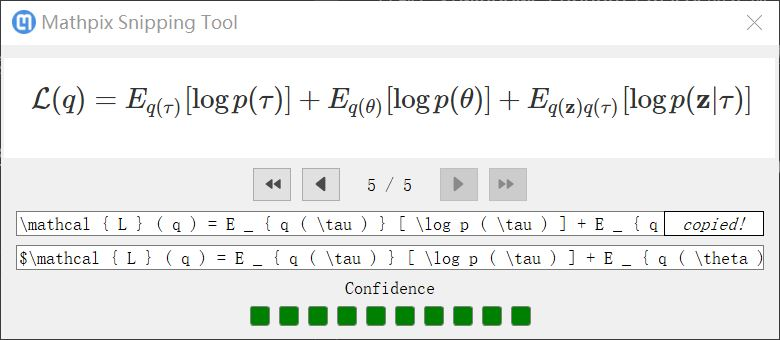

# 截图公式转换

## mathpix

[mathpix](https://mathpix.com/)支持数学公式转换。获取一个数学屏幕截图，就能转换成`LaTex`格式公式。目前已有`windows / ubuntu / macos`的实现，安装完成后，执行快捷键`Ctrl+Alt+M`，截取屏幕上的数学公式

测试：[examples.pdf](https://mathpix.com/examples.pdf)。完成截图后就能转换成`LaTex`公式

并且已经在你的剪切板上，直接复制即可

$$
\mathcal { L } ( q ) = E _ { q ( \tau ) } [ \log p ( \tau ) ] + E _ { q ( \theta ) } [ \log p ( \theta ) ] + E _ { q ( \mathbf { z } ) q ( \tau ) } [ \log p ( \mathbf { z } | \tau ) ]
$$

## 相关阅读

* [用这个漂亮的工具将方程式截图迅速转换为 LaTeX](https://zhuanlan.zhihu.com/p/48077774)