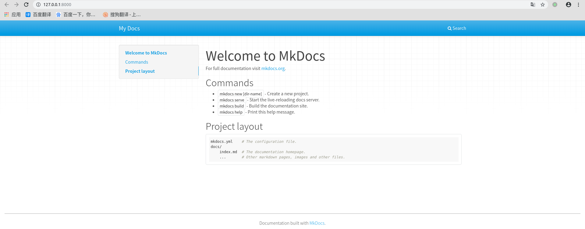

# 快速入门

## 新建

创建新的`MkDocs`工程

```
$  mkdocs new my-project
INFO    -  Creating project directory: my-project 
INFO    -  Writing config file: my-project/mkdocs.yml 
INFO    -  Writing initial docs: my-project/docs/index.md 
```

其生成文件夹`my-project`，里面包含两个文件`mkdocs.yml`和`docs/index.md`

```
.
├── docs
│   └── index.md
└── mkdocs.yml
```

## 部署

在`my-project`路径下启动服务器

```
$ mkdocs serve
INFO    -  Building documentation... 
INFO    -  Cleaning site directory 
[I 191218 15:51:51 server:296] Serving on http://127.0.0.1:8000
[I 191218 15:51:51 handlers:62] Start watching changes
[I 191218 15:51:51 handlers:64] Start detecting changes
```

启动后即可在浏览器登录`localhost:8000`



## 源文件&配置文件

`MkDocs`工程文档默认支持`Markdown`，默认的源文件夹为`docs`，使用`index.md`作为起始文件

启动服务器后，`MkDocs`会遍历搜索`docs`文件夹内所有的`.md`文件，并显示在网站上，除非在配置文件`mkdocs.yml`中设置属性`nav`，才仅显示指定文件

关于配置文件的解析参考下一章

## 构建

生成静态文件

```
$ mkdocs build
INFO    -  Cleaning site directory 
INFO    -  Building documentation to directory: /xxx/my-project/site
```

生成的静态文件保存在`site`文件夹。默认构建时不会消除之前已存在的文件，如果要移除旧的文件，添加参数`--clean`

```
$ mkdocs build --clean
INFO    -  Cleaning site directory 
INFO    -  Building documentation to directory: /home/zj/音乐/my-project/site
```

## 查询命令

```
$ mkdocs --help
$ mkdocs serve --help
$ mkdocs build --help
```