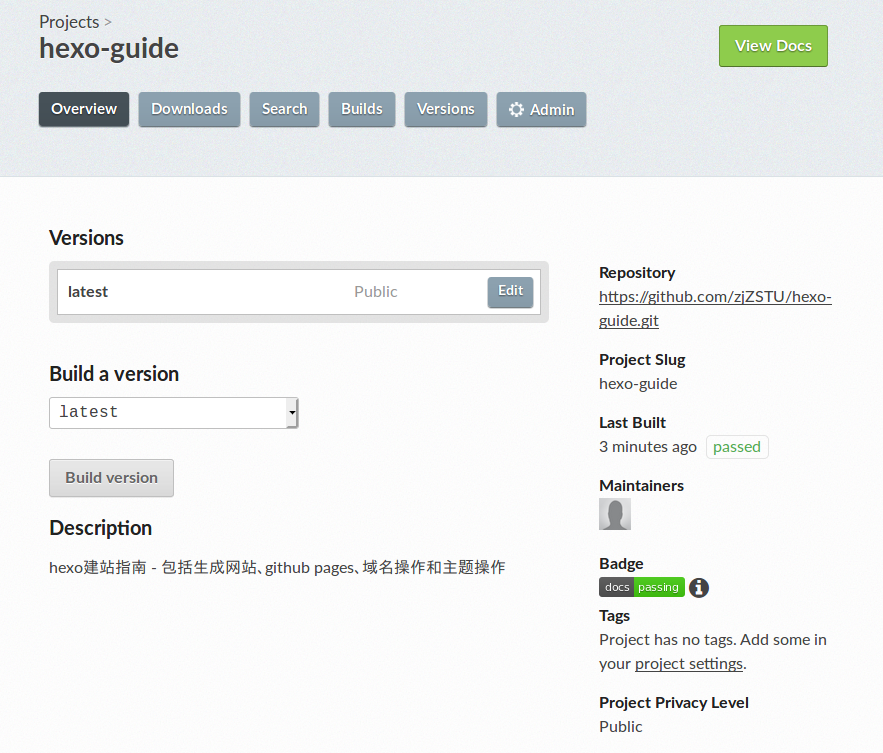

# 徽章

## 配置

在`ReadtheDocs`网站上新建工程后，可以添加`状态徽章`(`status badges`)

其位置在工程主页->概述(`Overview`)子页中

点击`Badge`选项下的`Get this badge`按钮，就会跳出相应使用链接

## 相关阅读

* [Badges](https://docs.readthedocs.io/en/stable/badges.html)