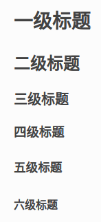

# reStructuredtext语法

* 注释
* 列表
* 类引号块
* 标题
* 源文件引用
* 超链接

## 注释

使用`..`表示注释

    .. 注释内容

    或

    .. 注释1
        注释2
        注释3

## 列表

    * This is a bulleted list.
    * It has two items, the second
    item uses two lines.

    1. This is a numbered list.
    2. It has two items too.

    #. This is a numbered list.
    #. It has two items too.

## 类引号块

    * this is
    * a list

        * with a nested list
        * and some subitems

    * and here the parent list continues

进行嵌套时，必须空一行

## 标题

段标题通过在标题下一行输入等于号（`'=='`）实现（**注意：`==`至少和标题一样长**）

    一级标题
    ===========

    二级标题
    **********

    三级标题
    ^^^^^^^^

    四级标题
    ---------

    五级标题
    >>>>>>>>>

    六级标题
    :::::::::

## 源文件引用

    .. include:: 源文件路径

## 超链接

页内链接

    # 引用锚点
    锚点_
    # 设置锚点
    .. _锚点:

外部链接

    引用名_
    # 输入引用名对应的链接地址
    .. _引用名: 链接地址

比如

    * hexo.io_
    * `hexojs/hexo`_

    .. _hexo.io: https://hexo.io/

    .. _`hexojs/hexo`: https://github.com/hexojs/hexo/　

**注意 1：引用名左右需要空格**

**注意 2：引用名如果带有空格或符号，用反引号括起来**