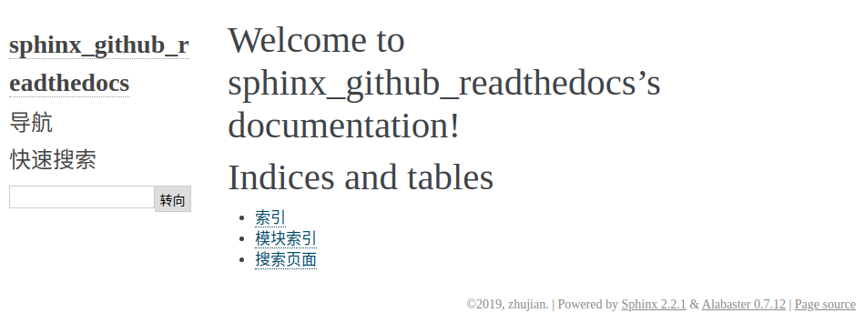

# 快速入门

`sphinx`提供了工具`sphinx-quickstart`用于快速生成一个文档工程

## sphinx-quickstart

新建空文件夹，该目录下，输入命令`sphinx-quickstart`启动一个工程，随后根据需求选择配置

```
$ sphinx-quickstart 
Welcome to the Sphinx 2.2.1 quickstart utility.

Please enter values for the following settings (just press Enter to
accept a default value, if one is given in brackets).

Selected root path: .  # 默认以当前目录作为根目录，默认将根目录作为源文件路径

You have two options for placing the build directory for Sphinx output.
Either, you use a directory "_build" within the root path, or you separate
"source" and "build" directories within the root path.
> Separate source and build directories (y/n) [n]: y # 输入`y`可以设置将源文件和输出文件放置在两个不同文件夹内

The project name will occur in several places in the built documentation.
> Project name: sphinx_github_readthedocs            # 输入工程名
> Author name(s): zhujian                            # 输入作者名
> Project release []: 2.0.0                          # 输入版本号

If the documents are to be written in a language other than English,
you can select a language here by its language code. Sphinx will then
translate text that it generates into that language.

For a list of supported codes, see
https://www.sphinx-doc.org/en/master/usage/configuration.html#confval-language.
> Project language [en]: zh_CN                       # 默认工程语言为英文，设置`zh_CN`为中文

Creating file ./source/conf.py.
Creating file ./source/index.rst.
Creating file ./Makefile.
Creating file ./make.bat.

Finished: An initial directory structure has been created.

You should now populate your master file ./source/index.rst and create other documentation
source files. Use the Makefile to build the docs, like so:
   make builder
where "builder" is one of the supported builders, e.g. html, latex or linkcheck.
```

## 工程结构

```
$ tree
.
├── build
├── make.bat
├── Makefile
└── source
    ├── conf.py
    ├── index.rst
    ├── _static
    └── _templates

4 directories, 4 files
```

* `build`(或`_build`)是输出文件路径
* `Makefile/make.bat`是构建文件
* `source`是源文件路径(在文件`conf.py`中包含了所有的配置选项)

## 构建

如果已经生成了`Makefile`文件，那么直接使用`make`命令就好了

    make builder 
    
`builder`指要构建的格式，比如`html,latex`等等

```
$ make html
Running Sphinx v2.2.1
loading translations [zh_CN]... done
making output directory... done
building [mo]: targets for 0 po files that are out of date
building [html]: targets for 1 source files that are out of date
updating environment: [new config] 1 added, 0 changed, 0 removed
reading sources... [100%] index                                                                                                  
looking for now-outdated files... none found
pickling environment... done
checking consistency... done
preparing documents... done
writing output... [100%] index                                                                                                   
generating indices...  genindexdone
writing additional pages...  searchdone
copying static files... ... done
copying extra files... done
dumping search index in Chinese (code: zh)... done
dumping object inventory... done
build succeeded.

The HTML pages are in build/html.
```

然后进入`./build/html`，打开`index.html`即可



也可以使用工具`sphinx-build`进行编译，操作如下：

    sphinx-build -b html sourcedir builddir

`sourcedir`指定源文件路径，`builddir`指定输出文件路径，`-b html`指定输出格式

## 相关阅读

* [Getting Started](http://www.sphinx-doc.org/en/master/usage/quickstart.html)