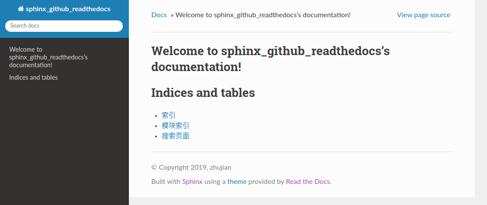

# 主题

## 内置主题

`sphinx`提供了多种内置主题，当前默认主题是`alabaster`，还有其他的主题 - [builtin-themes](http://www.sphinx-doc.org/en/master/usage/theming.html#builtin-themes)

## 主题替换

修改`conf.py`中的`html_theme`

```
# The theme to use for HTML and HTML Help pages.  See the documentation for
# a list of builtin themes.
#
# html_theme = 'alabaster'
html_theme = 'sphinx_rtd_theme'
```

修改成了`readthedocs`主题风格，它需要先自行安装

    pip install -U sphinx_rtd_theme



## 主题自定义

`sphinx`也支持自定义主题，或者对当前主题进行微调 - [using-a-theme](http://www.sphinx-doc.org/en/master/usage/theming.html#using-a-theme)
